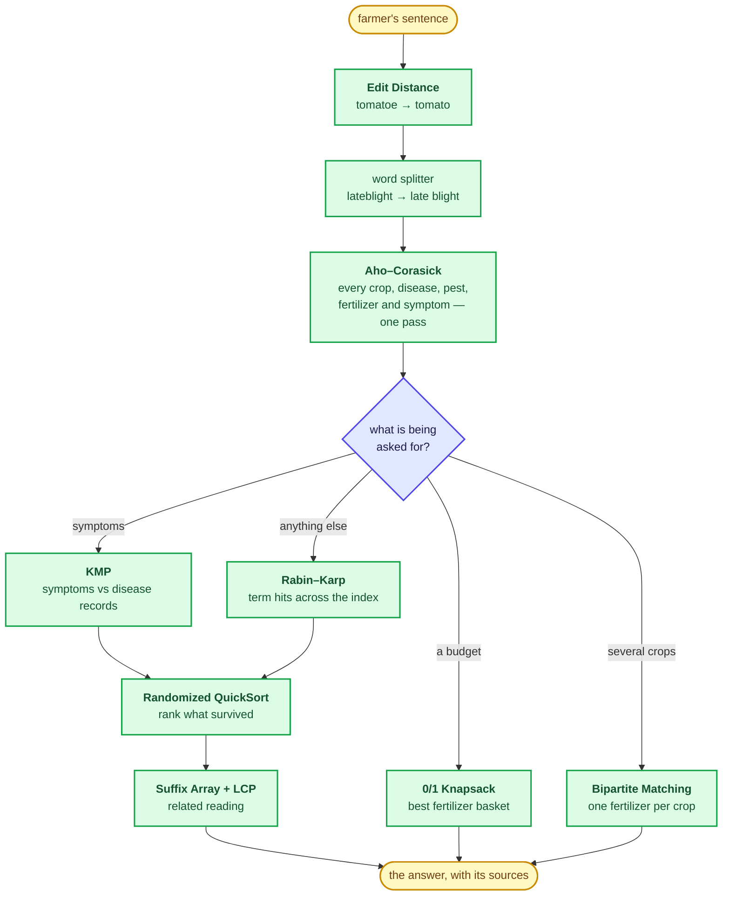

<div align="center">

# 🌾 FarmAssist

### A farming question, answered by algorithms — not by a model.

Type a sentence about a sick crop.<br>
Eight classical algorithms work out what it means, what is wrong with the plant,<br>
and which document deserves to be quoted back.

<br>


<br><br>

**KLH** · CSE 2026–27 · Section **S-06** · Team **20** · DSA-3 `25CS2103E`

</div>

---

## 📅 Where this stands

| | |
|---|---|
| 🎤 **Review 1 presentation** | **28 August 2026** |
| ⬆️ Last pushed to GitHub | 27 August 2026 |
| 📄 Review 1 deck & abstract uploaded | 26 August 2026 |
| 🌱 Repository created | 15 August 2026 |

---

## One sentence in

```
my tomato has brown spots and yellowing
```

Not one word of that is *understood*. It is **searched** — and that is the whole point of
the project. Three passes turn the sentence into an answer:

1. **Aho–Corasick** walks the sentence **once** and comes out knowing every crop, disease
   and symptom named in it — no matter how many patterns are in the automaton.
2. **KMP** takes each symptom and checks it, exactly, against every disease record.
3. **Rabin–Karp** rolls a hash over every document in the knowledge base and counts the
   term hits; that count *is* the relevance score. **KMP** then locates the winning term so
   the snippet can be cut around it.

Nothing is outsourced to the Java library on the way — no `String.contains()`,
no `Collections.sort()`.

---

## Watch it run

```text
  you › my tomato has brown spots and yellowing

   · Aho-Corasick  one pass over the sentence, 30 patterns, 3 hits

  ▌ READ  Aho-Corasick, one pass over the sentence ───────────────────────────
    my tomato has brown spots and yellowing
    ● crop tomato   ● symptom brown spots, yellowing
   · KMP           16 exact symptom searches over 8 disease records, 5 scored

  ▌ WHAT IT COULD BE  scored on the symptoms KMP matched ─────────────────────

  1. EARLY BLIGHT                                             ██████████ 8
     attacks   tomato, potato ◂ your crop
     symptoms  brown spots, yellowing, stunted growth
     matched   brown spots, yellowing ◂ KMP found these
     treat     Spray mancozeb every ten days and remove the lower infected
               leaves.
  ┈┈┈┈┈┈┈┈┈┈┈┈┈┈┈┈┈┈┈┈┈┈┈┈┈┈┈┈┈┈┈┈┈┈┈┈┈┈┈┈┈┈┈┈┈┈┈┈┈┈┈┈┈┈┈┈┈┈┈┈┈┈┈┈┈┈┈┈┈┈┈┈┈┈

  2. LEAF CURL VIRUS                                          ██████░░░░ 5
     attacks   cotton, tomato ◂ your crop
     symptoms  leaf curl, yellowing, stunted growth
     matched   yellowing ◂ KMP found these
     treat     Control the whitefly that carries it and pull out the infected
               plants.

  ▌ ARTICLES  ranked by Rabin-Karp term hits ─────────────────────────────────
   · KMP           located "tomato" in A05 at position 0

  1. Tomato from nursery to harvest                           ██████████ 2
     A05  ·  best term tomato  ·  2 hits in this article
     Tomato seedlings are transplanted at about twenty five days. Staking
     keeps the fruit off the soil and cut ...
```

Those dim `·` lines are the trace: **every time an algorithm runs, it says so**, on the
screen, during the demo. `trace off` hides them.

---

## The pipeline



---

## The eight

| # | Algorithm | Carries | Time |
|:--:|---|---|---|
| 1 | **KMP** | a symptom checked exactly against a disease record; the exact position of a term inside a document | `O(n + m)` |
| 2 | **Rabin–Karp** | one rolling hash over the whole index, counting term hits → the relevance score | `O(n + m)` expected |
| 3 | **Aho–Corasick** | every entity in the question found in a single pass; a second automaton rewrites local names — `paddy` → `rice` | `O(n + M + z)` |
| 4 | **Edit Distance** | spelling repair, typo'd greetings, and the "did you mean" when a search comes back empty | `O(n·m)` |
| 5 | **Suffix Array + LCP** | related articles, ranked by longest common substring | `O(n log²n)` build |
| 6 | **0/1 Knapsack** | the best fertilizer basket inside the farmer's budget | `O(items × budget)` |
| 7 | **Bipartite Matching** | a different fertilizer assigned to each crop, by Kuhn's augmenting paths | `O(V × E)` |
| 8 | **Randomized QuickSort** | the ordering of every ranked list on screen | `O(n log n)` expected |

The **[Review 1 build](review-1/)** is a deliberately small cut of this — **Aho–Corasick,
KMP and Rabin–Karp only**, over 12 articles and 8 diseases, so all three can be followed
end to end on one screen during the viva. It is the build in the transcript above.

---

## What it knows

| File | Rows | Holds |
|---|--:|---|
| `crops.txt` | 63 | season, soil, water need, N-P-K, duration, rainfall, spacing, varieties, yield |
| `diseases.txt` | 64 | symptoms and treatment |
| `pests.txt` | 44 | damage and control |
| `fertilizers.txt` | 38 | NPK, price, benefit |
| `articles.txt` | 62 | the documents the search reads |
| `symptoms.txt` | 74 | the patterns loaded into the automaton |
| `synonyms.txt` | 396 | local and alternate names mapped to one word |

Plain text, `|` separated, `#` for comments. **Add a row and the program picks it up on
the next run** — no code change, no rebuild of any index.

---

## Running it

```bash
javac -encoding UTF-8 -d out (everything under src)
java -Dstdout.encoding=UTF-8 -cp out ui.ConsoleChat data
```

Or double-click `FarmAssist.bat`, which opens its own UTF-8 terminal and compiles first.
A JDK is the only requirement — tested on **JDK 25**. No libraries, no build tool, no
network call at any point.

The screen is drawn on one 78-column grid, in colour, with box-drawing borders. Both are
detected at start up and both have an escape hatch: `color off` for plain text,
`ascii on` for `+---+` borders.

To run the **Review 1 build** instead — the same three algorithms, small enough to follow
by eye — go into [`review-1/`](review-1/) and double-click its own `run.bat`.

> Both builds compile from source on every launch. There is no jar to download, nothing to
> install, and `out/` is disposable — delete it and the next run rebuilds it.

---

## In this repository

```
KLH_CSE_2026-27_S6_20_FarmAssist/
├── FarmAssist.bat                  double-click this — opens a terminal, then runs
├── run.bat                         compile + run inside a terminal you already have
├── src/
│   ├── algo/                       THE EIGHT ALGORITHMS — pure, no project logic
│   ├── model/                      Crop · Disease · Fertilizer · Pest · Article
│   ├── engine/                     spelling, entities, intent, search, diagnosis,
│   │                               planning, recommendation, loading
│   ├── ui/                         the chat loop, the 78-column theme, the demo
│   └── util/                       the algorithm trace
├── data/                           the knowledge base — 8 editable text files
├── review-1/                       the three-algorithm build shown at Review 1
├── PROJECT.md                      the deep documentation: pipeline, demo script,
│                                   full layout, complexity table
├── Review-01.pptx                  the Review 1 deck
└── Team_20_FarmAssist_Project_Abstract.docx
```

📖 **[PROJECT.md](PROJECT.md)** is the one to read before the viva — it carries the
demo script, the exact question to type for each of the eight algorithms, and where
every one of them lives in the tree.

---

## Team 20

| | Roll number | |
|---|---|---|
| **Nimma Lokesh Reddy** | `2520030366` | S-06 |
| **Ramagiri Rishik Rao** | `2520030333` | S-06 |
| **Manne Yashwanth Manoj** | `2520030369` | S-06 |

<div align="center">
<br>

**Every answer on this screen was produced by an algorithm you can trace by hand.**

<sub>Built for DSA-3 (25CS2103E) · KL University, Hyderabad · 2026–27</sub>

</div>
